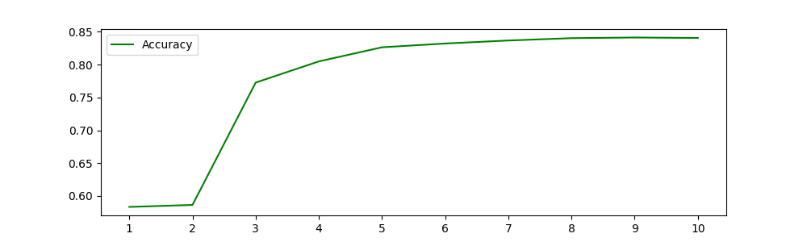
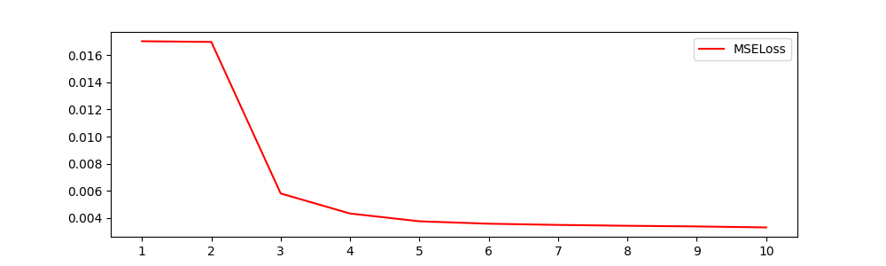
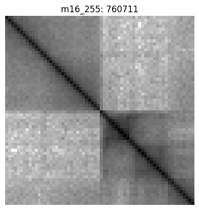
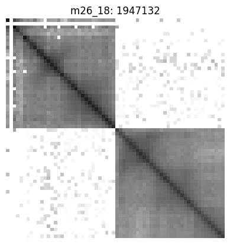

# Scaffolding based on Hi-C reads and Neural Networks
Deep Convolution Neural Network models for predicting distances between contigs based on Hi-C signal to facilitate scaffolding process.

## Table of contents
<!--ts-->
  * [Architecture](#architecture)
    * [Datasets](#datasets)
    * [Pretrained models](#pretrained-models)
    * [Testing](#testing)
  * [Installation](#installation)
  * [Usage example](#usage-example)
  * [Files](#files)
  * [Authors](#authors)
<!--te-->

## Architecture
We have developed Neural Network models for distance estimation between contigs based on Hi-C signal. All models works with Hi-C interaction matrices between contigs in [mcool](https://cooler.readthedocs.io/en/latest/schema.html) format. 

The input for the model is 3d matrices of size *batch* x 32 x 32 subsampled from the Hi-C matrix which correspond to interactions between the end of one contig and the start of another contig. Neural network implementation is based on **LeNet** architecture and consists of Convolutional layers with 5 x 5 kernel, ReLU activation function and Max Pooling layers. Finally, fully connected layers are used, outputing one number in range [0, 1] which corresponds to the distance approximation as a fraction of predefined distance.

*Adam* with default parameters was used as an optimizer. Loss was measured with Mean Squared Error function.

### Datasets
We used chm13.draft_v1.0 dataset –  complete telomer-to-telomer manually curated reconstruction of a human genome ([https://github.com/nanopore-wgs-consortium/CHM13](https://github.com/nanopore-wgs-consortium/CHM13)). 

<span style="color:red">TODO: describe Hi-C matrix construction</span>

### Pretrained models
We used chromosomes 2 to 22 from chm13 to generate training dataset. We subsampled contigs from each chromosome using distances from 0 to 50 bins and took the matrices corresponding to links between these contigs. We also filtered out matrices, in which there were less than 1000 non-zero elements out of 1024 total elements. Various resolutions were used, namely 5k, 10k, 50k and 100k, resulting in different maximum possible predicted distances: 250 Kbp, 500 Kbp, 2.5 Mbp and 5 Mbp respectively. All models were trained for 10 epochs.
Pretrained models can be found in `models` folder.

### Testing
Testing was carried out on the chromosome 1 from chm13. Input data was generated using the same technique as for training dataset. Testing accuracy, estimated as a proportion of predictions with absolute error less than 0.1 from correct value, reached 84%. Accuracy and loss curves are presented on the figures below.





## Installation

#### Requirements
- [Cooler](https://cooler.readthedocs.io/en/latest/quickstart.html)
- [Pytorch](https://pytorch.org/) version 1.7.0
- GPU

This tool is implemented as a set of python scripts, so it requires no installation. To get an example of using the scripts, please refer to [Usage example](#usage-example) section

Scripts have been tested under CentOS Linux release 7.4.1708, but should generally work on Linux distributions.

## Usage example

To predict the distance between contigs, one needs pretrained model, hi-c matrix and `src/test.py` script.

We will use sample hi-c matrix `test/mat18_50k.cool` to predict the closest contig to the longest *m17_22* contig. We will use model with 50k resolution (`models/HiC_LeNet_regression_50k.tar`). To run this script we will use the command:
```
python3 test.py
```
After running the script, we will get the images of all possible contigs junctions with the given *m17_22* contig as well as the predicted distance in the header. Examples of such images are presented below. Indeed, the *m16_255* contig is known to be the closest neighbour with true distance of 588 Kbp. So the error is about 30%.





## Files

- `src/` – folder with python source code
- `models/` – folder with pretrained neural network models
- `test/` – folder with sample hi-c matrix
- `img/` – folder with readme images

## Authors
**Implementation:** 

Artem Ivanov, [ITMO University](https://itmo.ru/), Saint-Petersburg, Russia.

**Supervisors:** 

Pavel Avdeyev, [The George Washington University](https://www.gwu.edu/), Washington DC, USA

Nikita Alexeev, [ITMO University](https://itmo.ru/), Saint-Petersburg, Russia
